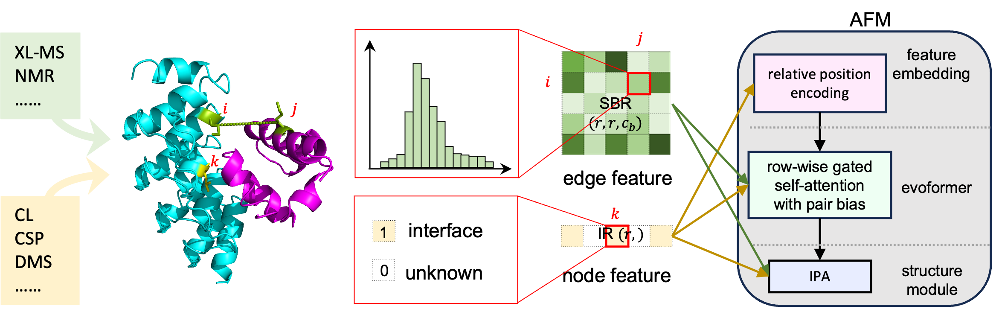

# GRASP-JAX

Our tool provides accurate protein complex structure prediction, seamlessly integrated with diverse experimental restraints, using JAX. 
The original model was trained with the MindSpore version, which is available in [GRASP-MS](https://github.com/xiergo/GRASP-MS).

## Installation

To install GRASP-JAX, follow these steps:

1. Clone the repository and navigate into it.

   ```bash
   git clone https://github.com/xiergo/GRASP-JAX.git
   cd ./GRASP-JAX
   ```

2. Download the necessary genetic database as described in [AlphaFold](https://github.com/google-deepmind/alphafold). Additionally, download the GRASP model weights from [this link](https://osf.io/6kjuq/) and move them to the directory where you stored the AlphaFold genetic database:


    ```bash
    mkdir PATH_TO_ALPHAFOLD_DATASET/params/
    mv params_model_1_v3_v11_*.npz PATH_TO_ALPHAFOLD_DATASET/params/
    ```

3. create a conda Enviroment, and activate it:

   ```bash
   conda create -n GRASP python=3.9
   conda activate GRASP

4. Install the necessary packages:
   ```
   pip install -r requirements.txt
   conda install -c conda-forge pdbfixer
   ```


  The installation takes ~10 minutes.
  
## GRASP Restraints File Preparation

GRASP supports the integration of diverse restraints to generate protein models. We provide two types of restraints files: `.pkl` and `.txt`. Below is a detailed guide on how to prepare and use these files.

### Type 1: `.pkl` File

The `.pkl` file format uses a dictionary to store restraint information for GRASP inference. The dictionary contains three key components:

- **`sbr`**: An array of shape (`N_residues`, `N_residues`, `N_bins`), where `N_bins` represents the number of distance bins used for the restraints. This array holds the distogram of the restraints between residue pairs.
- **`sbr_mask`**: An array of shape (`N_residues`, `N_residues`), where `1` indicates a restraint between a pair of residues and `0` means no restraint exists.
- **`interface_mask`**: An array of shape (`N_residues`,), where `1` marks interface residues and `0` indicates the absence of relevant information.

Here, `N_residues` refers to the total number of residues in the protein complex.

#### Customizing RPR Restraints Distribution
The `.pkl` format is not human-readable and can be large in size, but it offers flexibility in modifying the RPR restraints distribution. To customize the RPR restraints distribution, you can modify the `sbr` array in the restraints dictionary. This array allows you to change the distribution of the RPR restraints by adjusting the values within it.

### Type 2: `.txt` File

The `.txt` file format is human-readable and easier to modify, making it the recommended choice for storing restraints. Each line in the file represents a single restraint, and the format depends on the type of restraint.

#### RPR Restraint
For RPR restraints, each line should contain two residues, the distance cutoff, and optionally, the false discovery rate (FDR). The format is:
```
residue1, residue2, distance_cutoff[, fdr]
```

- **`residue1`** and **`residue2`** are formatted as `chain_index-residue_index-residue_type`, where:
  - `chain_index` is 1-indexed (referring to the position of the chain in the FASTA file).
  - `residue_index` is 1-indexed (the position of the residue within the chain).
  - `residue_type` is the single-letter amino acid code, which must match the corresponding entry in the FASTA file.
  
  Example: `1-10-G` represents the 10th residue in the first chain, and the residue is Glycine (G).

- **`distance_cutoff`**: Specifies the maximum allowed distance between the two residues.
- **`fdr`**: (Optional, defaulting to 0.05) Represents the false discovery rate for the RPR restraint.

#### IR Restraint
For interface restraints (IR), the format is simpler:

```
residue
```

The residue is specified in the same format as above: `chain_index-residue_index-residue_type`.

#### Example of a `.txt` Restraints File

```
1-10-G, 1-20-A, 8.0, 0.05
1-15-L
2-16-K
```

In this example:
- The first line represents an RPR restraint between the 10th Glycine (G) and the 20th Alanine (A) in chain 1, with a distance cutoff of 8.0Å and an FDR of 0.05.
- The second line is an IR restraint for the 15th Leucine (L) in chain 1.
- The third line is an IR restraint for the 16th Lysine (K) in chain 2.

**Note**: The order of the lines does not matter. Multiple lines linked to the same residue pair are not allowed. If multiple types of crosslinkers crosslink to the same residue pair, you need to decide which one to use. Commonly, the one with the shortest distance cutoff is used.

#### Customizing the RPR Restraints Distribution
You can also customize the RPR restraints distribution using the `.txt` file. To do this, you need to add the customized RPR restraints distribution to the `XL_DISTRI` dictionary in the `generate_restr.py` script. The `XL_DISTRI` dictionary is a dictionary of pre-defined distributions, where the keys are the distribution names (e.g., crosslinker names), and the values are arrays of shape (`N_bins`,) representing the distribution of the restraints. The array should sum up to 1.

Here is an example of a `DSS` distribution:

```python
XL_DISTRI = {
    'DSS': np.array(
        [0.        , 0.00614887, 0.0092233 , 0.0368932 , 0.00614887,
        0.02459547, 0.04304207, 0.06148867, 0.05841424, 0.07993528,
        0.09838188, 0.05841424, 0.08300971, 0.0461165 , 0.04919094,
        0.0461165 , 0.05841424, 0.0368932 , 0.03996764, 0.02152104,
        0.01537217, 0.01537217, 0.01537217, 0.00307443, 0.01537217,
        0.00614887, 0.01537217, 0.01666667, 0.01666667, 0.01666667])
}

```
After adding the customized RPR restraints distribution to the `XL_DISTRI` dictionary, you can use the keys in the `XL_DISTRI` dictionary as replacements for `cutoff` and `fdr` in the `.txt` file. For example, if you want to use the DSS distribution instead of a uniform distribution with a distance cutoff of 8.0Å and an FDR of 0.05, you can replace `8.0` and `0.05` with `DSS` in the `.txt` file:

```
1-10-G, 1-20-A, DSS
1-15-L
2-16-K
```

### Conversion between `.pkl` and `.txt` files
We provide a script `generate_restr.py` to convert between `.pkl` and `.txt` files. To use this script, run the following command:

```bash
python generate_restr.py -h
```
This will display the help message:

```
usage: Convert restraints from text (txt file) to array dictionary (pkl file) format and vice versa
       [-h] [-o OUTPUT_FILE] [-d] restraints_file fasta_file

positional arguments:
  restraints_file       txt or pkl file containing the restraints. See README for the format.
  fasta_file            path to the fasta file

optional arguments:
  -h, --help            show this help message and exit
  -o OUTPUT_FILE, --output_file OUTPUT_FILE
                        path to the output file. If not specified, the output file will be the same as the
                        restraints file with extension changed to pkl or txt, depending on the input file
                        format.
  -d, --debug           run additional checks to verify the conversion
```
You need to provide two necessary files:

- restraints_file: The file you want to convert from (either `.txt` or `.pkl`).

- fasta_file: The FASTA file containing the sequence of the protein complex, which should be the one used for searching through the genetic database.

For example:

```bash
unzip examples/1DE4.zip
# convert RPR restraints from pkl to txt format
python generate_restr.py 1DE4/RPR_restr.pkl 1DE4/1DE4.fasta
# convert IR restraints from pkl to txt format
python generate_restr.py 1DE4/IR_restr.pkl 1DE4/1DE4.fasta
```

## Run GRASP

To run GRASP, you can use the `run_grasp.py` script.

### Arguments
To perform inference using GRASP, you must first prepare a feature dictionary utilizing AlphaFold-multimer's protocol. Alternatively, you can specify the required arguments to generate the feature dictionary. Below are some unique arguments specifically for GRASP inference:
```bash
run_grasp.py:
  --feature_pickle: Path to the feature dictionary generated using AlphaFold-
    multimer's protocal. If not specified, other arguments used for generating
    features will be required.
  --iter_num: Maximum iteration for iterative restraint filtering.
    (default: '5')
    (an integer)
  --mode: The mode of running GRASP, "normal" or "quick".
    (default: 'normal')
  --output_dir: Path to a directory that will store the results.
  --resolution: Resolution of the mrc file
    (default: '10.0')
    (a number)
  --restraints_file: Path to a restraint file. If not provided,
    inference will be done without restraints.
   --rank_by: <plddt|ptm>: Specifies the metric for ranking models.
    If set to "plddt" (default), models are ranked by pLDDT.
    If set to "ptm", models are ranked using the weighted score 0.2*pTM + 0.8*ipTM.
    In both cases, models with a recall value not less than 0.3 are prioritized.
    (default: 'plddt')
```
The other arguments are identical to those used in AlphaFold. You can view the complete list of arguments by typing `python run_grasp.py --help`.

### Examples


```bash
# you can run GRASP from a sequence, some path need to set to your own path in run_grasp_from_seq.sh
bash run_grasp_from_seq.sh \
  fasta_path \
  restraints_file \
  output_directory

# or from a pre-computed feature dictionary pickle file
python run_grasp.py \
  --feature_pickle /path/to/feature_dict.pkl \
  --output_dir /path/to/output_directory \
  --restraints_file /path/to/restraints_file.pkl 

# fasta_path should be provided when restraints_path is not a ".pkl" file
python run_grasp.py \
  --feature_pickle /path/to/feature_dict.pkl \
  --fasta_path /path/to/fasta_file.fasta \
  --output_dir /path/to/output_directory \
  --restraints_file /path/to/restraints_file.txt 
```


## Outputs

   The output directory will include following files:

   * ranked_*.pdb : pdb files ranked by plddt and recall.
   
   * unrelaxed_model_1_v3_v11_{ckpt}\_{seed}_{iter}.pdb: predicted structure in each iteration.

   * unrelaxed_model_1_v3_v11_{ckpt}\_{seed}_final.pdb: the predicted structure in the final iteration
     
   * unrelaxed_model_1_v3_v11_{ckpt}\_{seed}_info.tsv: summary of the predicted structure in each iteration. The columns are:
     * 'Iter': iteration,
     * 'Conf': average pLDDT across all residues,
     * 'RankScore': 0.8ipTM + 0.2pTM,
     * 'Total': total number of restraints used in this iteration,
     * 'Remove': number of restraints removed after filtering in this iteration,
     * 'Rest': number of restraints remaining after filtering in this iteration,
     * 'MaxNbDist': maximum NBCA distance (neighboring CA distance), where NBCA distance of a residue is defined as the average CA distance to its two (one for terminal residues) flanking residues,
     * 'BreakNum': number of breaks in this iteration,
     * 'Recall': satisfication rate of all restraints provided before the first iteration,
     * 'Recycle_num': number of recycles in this iteration,
     * 'ViolNum': number of major violations (exceeding a cutoff of 5Å) of restraints at the end of this iteration,
     * 'MaxViolDist': maximum violation distance of restraints at the end of this iteration.

## Integrated modeling with Combift

This section demonstrates how to integrate Combfit into GRASP to refine protein complex models using cryo-EM data. Before running GRASP with Combfit, you must install [**powerfit3**](https://github.com/xinyuduchem/Powerfit3). After installation, you can run the integrated pipeline with a single command, for example:
```bash
bash run_grasp_w_em.sh \
    -d /path/to/AF2_database \
    -o ./integrated_output \
    -f ./8cx0/8cx0.fasta \
    -t 2021-10-08 \
    -z ./8cx0/features.pkl \
    -q ./8cx0/both_K_1v1_interface.pkl \
    -y ./8cx0/emd_27032_width_5.map \
    -m multimer \
    -s 7.8 \
    -x 8cx0 \
    -g
```
In this example, GRASP leverages AlphaFold predictions alongside cryo-EM density maps through Combfit’s fitting algorithms, allowing for more accurate and robust structural modeling of protein complexes.

## Dataset in GRASP paper

  You can download all datasets in GRASP original paper in the [link](https://osf.io/6kjuq/)

## Citations
If you use this package, please cite as the following:
```python
@article {Xie2024.09.16.613256,
	author = {Xie, Yuhao and Zhang, Chengwei and Li, Shimian and Du, Xinyu and Wang, Min and Hu, Yingtong and Liu, Sirui and Gao, Yi Qin},
	title = {Integrating various Experimental Information to Assist Protein Complex Structure Prediction by GRASP},
	elocation-id = {2024.09.16.613256},
	year = {2024},
	doi = {10.1101/2024.09.16.613256},
	publisher = {Cold Spring Harbor Laboratory},
	eprint = {https://www.biorxiv.org/content/early/2024/09/21/2024.09.16.613256.full.pdf},
	journal = {bioRxiv}


